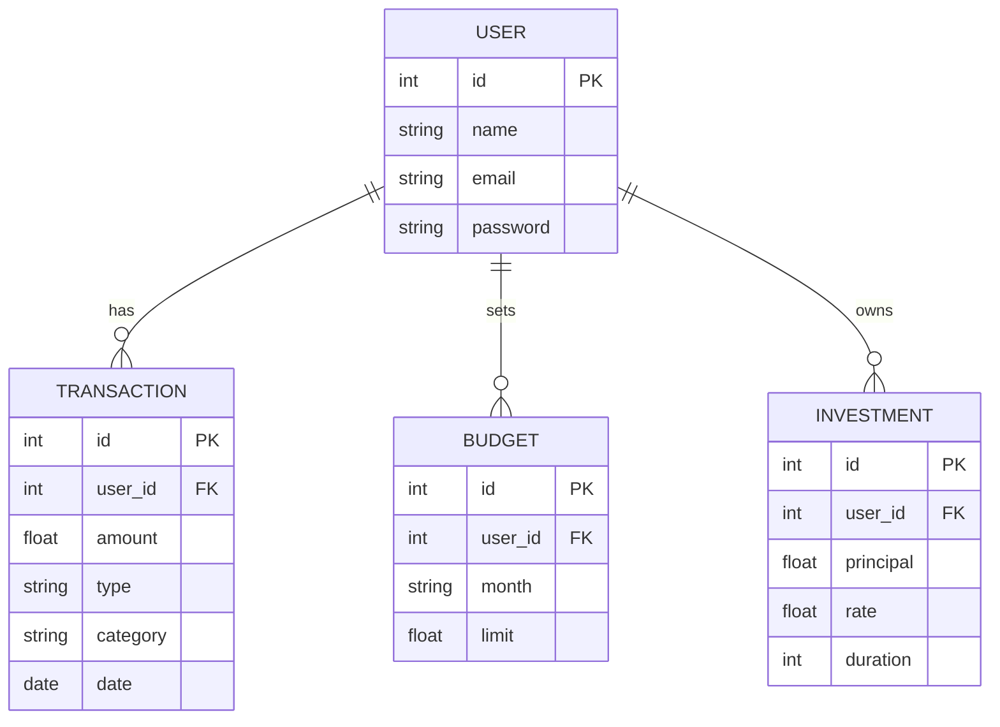

```mermaid
erDiagram
    USER {
        int id PK
        string name
        string email
        string password
    }

    TRANSACTION {
        int id PK
        int user_id FK
        float amount
        string type
        string category
        date date
    }

    BUDGET {
        int id PK
        int user_id FK
        string month
        float limit
    }

    INVESTMENT {
        int id PK
        int user_id FK
        float principal
        float rate
        int duration
    }

    USER ||--o{ TRANSACTION : has
    USER ||--o{ BUDGET : sets
    USER ||--o{ INVESTMENT : owns
```
