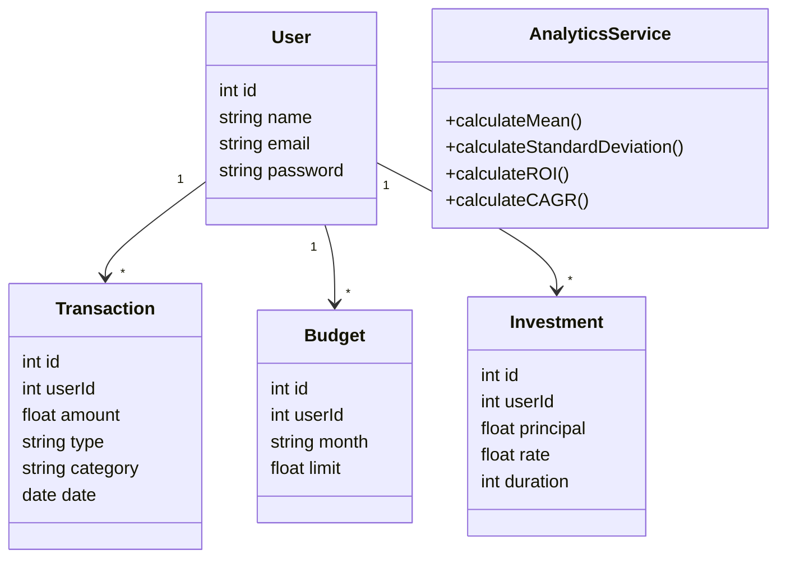

```mermaid
classDiagram
    class User {
        int id
        string name
        string email
        string password
    }

    class Transaction {
        int id
        int userId
        float amount
        string type
        string category
        date date
    }

    class Budget {
        int id
        int userId
        string month
        float limit
    }

    class Investment {
        int id
        int userId
        float principal
        float rate
        int duration
    }

    class AnalyticsService {
        +calculateMean()
        +calculateStandardDeviation()
        +calculateROI()
        +calculateCAGR()
    }

    User "1" --> "*" Transaction
    User "1" --> "*" Budget
    User "1" --> "*" Investment
```
