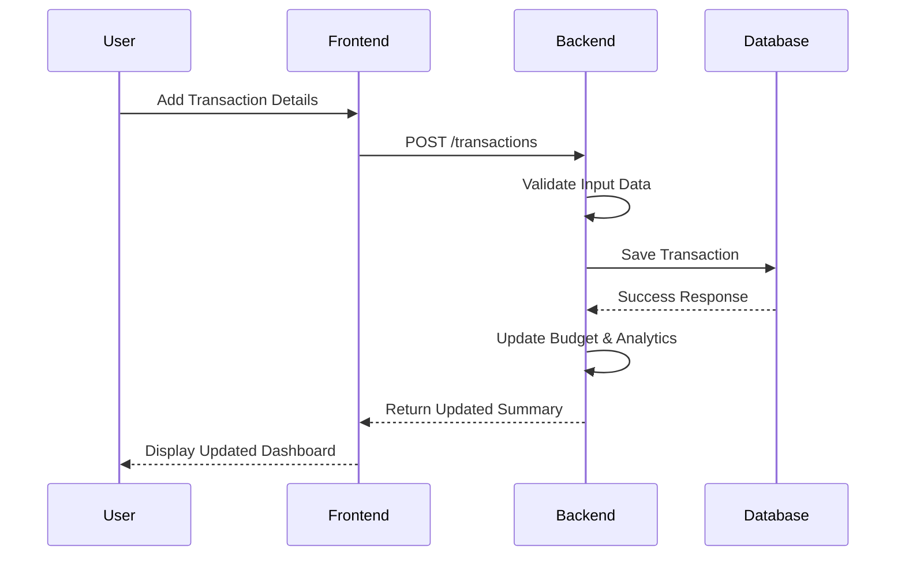

# Sequence Diagram – Add Transaction Flow

```mermaid
sequenceDiagram
    participant User
    participant Frontend
    participant Backend
    participant Database

    User->>Frontend: Add Transaction Details
    Frontend->>Backend: POST /transactions
    Backend->>Backend: Validate Input Data
    Backend->>Database: Save Transaction
    Database-->>Backend: Success Response
    Backend->>Backend: Update Budget & Analytics
    Backend-->>Frontend: Return Updated Summary
    Frontend-->>User: Display Updated Dashboard
```
